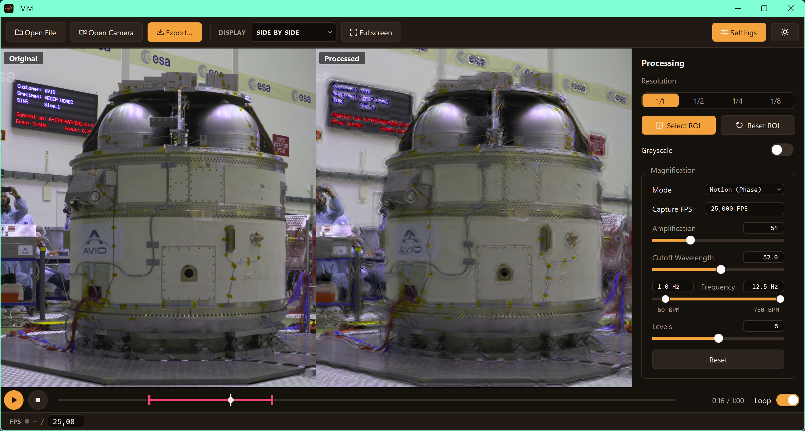
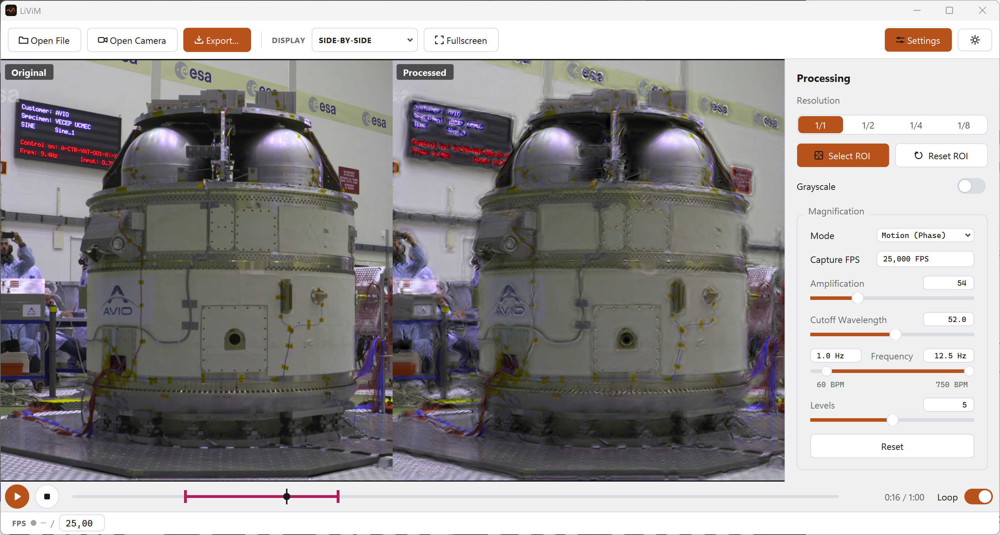

# LiViM

**Live Video Magnification** amplifies motion and color changes too subtle to see by eye — live from a
webcam or a video file. It implements the MIT CSAIL Eulerian video magnification techniques
([References](#references)) with a Qt 6 GUI.

| Dark                               | Light                                |
| ---------------------------------- | ------------------------------------ |
|  |  |

Footage: [AVUM shaker testing](https://www.esa.int/ESA_Multimedia/Videos/2018/11/AVUM_shaker_testing)
(ESA).

## Features

- Three magnification algorithms:
  - **Motion (Laplace)** - Laplacian pyramid + temporal IIR bandpass; classic Eulerian motion.
  - **Motion (Phase)** - phase-based on a Riesz pyramid + Butterworth bandpass; less noise.
  - **Color** - Gaussian pyramid + ideal FFT bandpass over a rolling window (e.g. blood flow).
- **Videos**: Frame-accurate timeline (scrub, in/out trim, loop) and manual playback speed control.
- **Cameras**: Capture via V4L2, Media Foundation, AVFoundation.
- **Comparison views**: processed, original, side-by-side, top/bottom - synced to the same frame.
- **Real-time controls**: processing resolution (1/1–1/8), a drawable ROI, grayscale.
- **Export**: MP4 (H.264), AVI (MJPG), or MKV (FFV1, lossless).
- Light/dark theme following the OS.

## Installation

Prebuilt packages are on the [Releases](../../releases) page:

| Platform | Files                                 |
| -------- | ------------------------------------- |
| Linux    | `.deb`, `.rpm`, `.AppImage` (x86_64)  |
| Windows  | NSIS `.exe`, portable `.zip` (x86_64) |
| macOS    | `.dmg` (Apple Silicon)                |

The video view needs OpenGL 3.3 (core profile).

### Before you start

- **macOS** - Gatekeeper blocks the app. Right-click → Open once, or
  `xattr -dr com.apple.quarantine /Applications/livim.app`.
- **Windows** - SmartScreen warns on the installer; click "More info" → "Run anyway".
- **Linux** - Camera access needs your user in the `video` group.

## Usage

Open a file or a camera, pick a **Display** mode (Processed / Original / Side-by-Side /
Top-and-Bottom — Original doubles as the off switch, since it skips magnification entirely), then
tune the **Processing** panel: resolution, ROI, grayscale, and the magnification parameters below.
Reset restores the current mode's defaults. F11 toggles fullscreen, Esc leaves it.

| Parameter           | Motion (Laplace) | Motion (Phase) | Color | Meaning                                                                                |
| ------------------- | :--------------: | :------------: | :---: | -------------------------------------------------------- |
| Amplification       |        ✓         |       ✓        |   ✓   | Effect strength (also amplifies noise).                                                |
| Cutoff Wavelength   |        ✓         |       ✓        |   –   | Spatial cutoff (%); higher = coarser structures / less noise.                          |
| Frequency band (Hz) |        ✓         |       ✓        |   ✓   | Temporal passband, dual-handle slider (also BPM), capped at Nyquist (Capture FPS ÷ 2). |
| Chroma attenuation  |        ✓         |       –        |   –   | How much color is carried with the magnified motion.                                   |
| Levels              |        ✓         |       ✓        |   ✓   | Pyramid depth; higher = larger spatial scale of the effect.                            |

**Capture FPS** is the true footage rate the temporal filters use to compute the Hz band. For
high-speed footage played back slowly, set the real capture rate (e.g. 1000) regardless of playback
rate.

The **FPS readout** in the bottom bar shows how well processing keeps up with the source:

- **Videos** play back at the rate set next to the readout. If your machine can't keep up, playback
  slows down rather than dropping frames — nothing is buffered ahead, so use Export when you need
  the full-rate result.
- **Cameras** run at whatever the hardware delivers, so frames are dropped under load. Lower the
  processing resolution or shrink the ROI to keep up.

**Export** opens a dialog pre-filled with the current settings (layout, output fps, format, and for
files a frame range). The render previews live in the main window and can be aborted at any point.
File exports re-decode the chosen range at full quality; camera exports first record raw frames into
RAM — which grows quickly, so recording stops automatically at 8 GB — and process them afterwards.
*Video only, no audio.*

## Building from source

Dependencies (Qt 6, OpenCV, FFmpeg) are built by [vcpkg](https://vcpkg.io); the first
configure compiles them (~30–90 min, once). You need a C++20 compiler, CMake ≥ 3.25, Ninja, nasm,
and vcpkg with `VCPKG_ROOT` set.

```bash
# Linux - setup-linux.sh installs system packages (apt/dnf/pacman) and bootstraps vcpkg
scripts/setup-linux.sh --configure
cmake --build --preset gcc-release && ./build/gcc/RelWithDebInfo/livim

# Windows (x64 Native Tools prompt) - needs VS 2022 with the C++ CMake tools
cmake --preset msvc && cmake --build --preset msvc-release

# macOS - xcode-select --install; brew install cmake ninja nasm pkg-config
cmake --preset appleclang && cmake --build --preset appleclang-release
```

`cmake --list-presets` shows what your machine offers; `*-release` is RelWithDebInfo, `*-debug` a
debug build.

## References

- Wu et al., [Eulerian Video Magnification](https://people.csail.mit.edu/mrub/evm/), SIGGRAPH 2012
  - Motion (Laplace) and Color.
- Wadhwa et al., [Phase-Based Video Motion Processing](https://people.csail.mit.edu/nwadhwa/phase-video/),
  SIGGRAPH 2013, and [Riesz Pyramids for Fast Phase-Based Video Magnification](https://people.csail.mit.edu/nwadhwa/riesz-pyramid/),
  ICCP 2014 - Motion (Phase).
- MIT CSAIL [video magnification project](https://people.csail.mit.edu/mrub/vidmag/).

## License

GNU Affero General Public License v3.0 - see [LICENSE](LICENSE). A separate commercial license is
available from the maintainer. Third-party components, dynamically linked: Qt 6 (LGPLv3), OpenCV
(Apache-2.0), FFmpeg (LGPLv2.1+, no GPL components).

## Slopclaimer

The color and motion magnification algorithms, the pipeline and its various optimizations were part
of my bachelor thesis at Universität Tübingen in 2015. Reviving this work and creating an actually
useful program that doesn't crash every other click was a dream I never found time for.

This app is **heavily** vibecoded and to be honest, as a solo dev with a full-time job who doesn't
want money for this (I don't keep you from donating tho), it wouldn't be possible in this scope
without the help of AI.